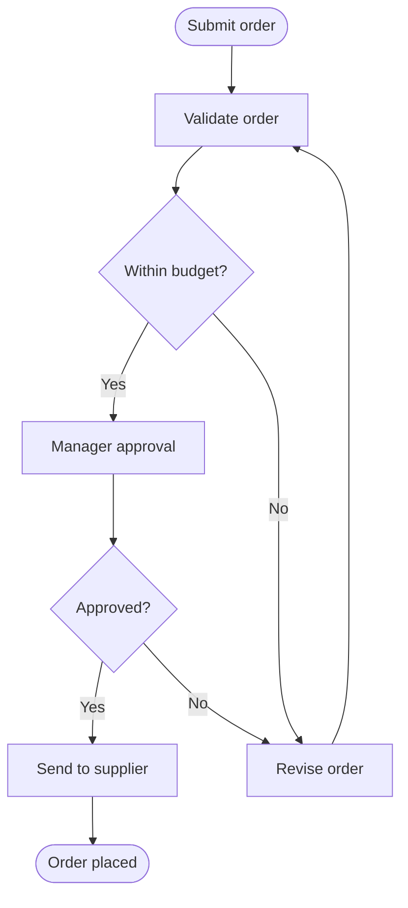
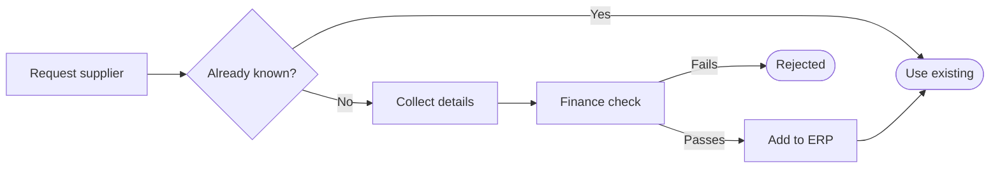
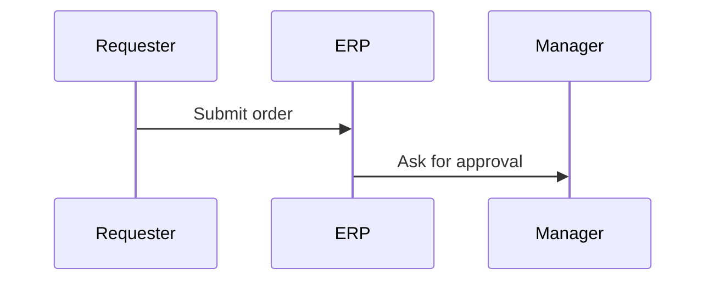

# Purchase orders

How a purchase order gets from a requester to a supplier.

## Purchase order approval

```mermaid
flowchart TD
  A([Submit order]) --> B[Validate order]
  B --> C{Within budget?}
  C -->|Yes| D[Manager approval]
  C -->|No| E[Revise order]
  E --> B
  D --> F{Approved?}
  F -->|Yes| G[Send to supplier]
  F -->|No| E
  G --> H([Order placed])
  class E rework

  %% note A: The requester enters supplier, items and cost centre.
  %% note B: Checks the supplier is active and the totals add up.
  %% note C: Compares the order total with what is left in the cost centre budget.
  %% note D: The line manager reviews the order and the reason for it.
  %% note E: The requester changes quantities, supplier or cost centre, then resubmits.
  %% note F: The manager approves, or sends it back with a comment.
  %% note G: The order is sent to the supplier.
  %% note H: The supplier has the order. Nothing more happens in this flow.

  %% step: An order comes in | A>B | A requester submits a purchase order. Validation runs before anyone is asked to approve.
  %% step: The budget check | B>C | A valid order is compared with the remaining budget. This is the first place the flow can turn back.
  %% step: The straight path | A>B>C>D>F>G>H | Within budget and approved. The order goes to the supplier with no rework.
  %% step: The revision loop | loop 1 | Over budget. The requester revises and the order is validated again.
  %% step: Sent back by the manager | loop 2 | Within budget but not approved. The longer loop also passes through Revise order.
```

## Supplier onboarding

```mermaid
flowchart LR
  req[Request supplier] --> chk{Already known?}
  chk -->|Yes| use([Use existing])
  chk -->|No| form[Collect details]
  form --> vet[Finance check]
  vet -->|Fails| rej([Rejected])
  vet -->|Passes| add[Add to ERP]
  add --> use
```

## Who talks to whom

```mermaid
sequenceDiagram
  Requester->>ERP: Submit order
  ERP->>Manager: Ask for approval
```
